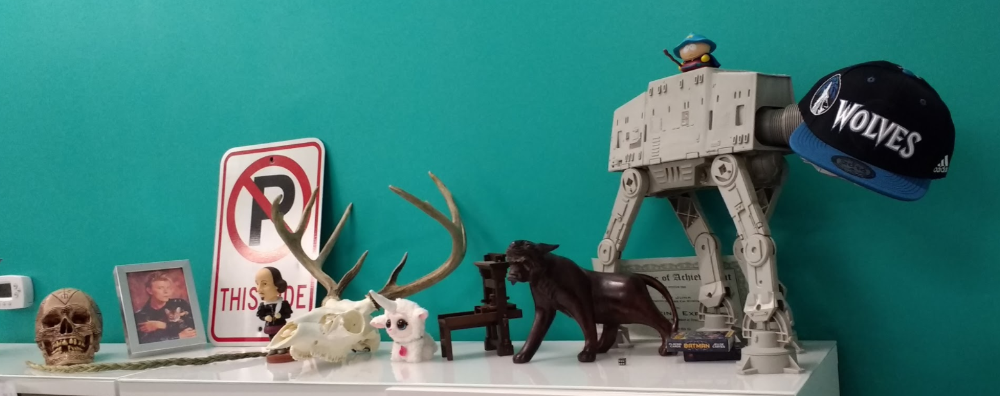

# Full Stack with Auth Peer Project 

Technologies
------------
* Mongo
* Express
* Angular
* Node
* Passport
* git
* github

Project Description
-------------------
Our client, **Prime Digital Academy: Room 2**, has asked for an app to simulate the behavior of their shelf. That is, a list of items placed on the classroom shelf.

Any visitor to the page can view the shelf, but only logged in users should be able to place objects on the shelf.

This will require some research, design, an implementation. Include a readme.md that includes the names of the group members and your team name/number. As well as any planning/docs. These can be in digital format or even pics of whiteboard/notebook sketches.

Shelf Object
------------
Items placed on the shelf should have the following data:

* description
* placer (user)
* image url (optional)

Use branching and github effectively. Prioritize your tasks. We are directly modeling a work assignment and part 1 of this assignment is to have an '*EOD Push*' - **End of Day Push** to remote origin master. That is, as you wrap your day's work, merge what works to master and push to github. Incomplete or not-working code can stay on it's own branch and should not be merged to master. This branch can, however, be pushed to github so it is available in remote.

Hard Mode
----------
* only logged in users can remove objects from the shelf
* styling

Pro Mode
--------
* logged in users can only remove their objects from the shelf
* show list of users only to logged in users

Super Mode
----------
* filter output by user (click on a user to only show items by that user)
* users can re-order shelf
